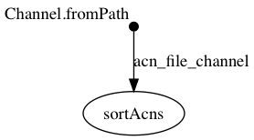

## Synopsis

dans ce workflow, on définit un `flux`/ `channel`/ `stream` de noms de fichiers spécifié en argument.

```
acn_file_channel = Channel.fromPath( "${params.acns}")
```

chacun de ces fichiers sert de `input` pour le workflow.

```
        input:
                file acnFile from acn_file_channel

```

## nextflow

### ./workflow.nf

```groovy
  1   acn_file_channel = Channel.fromPath( "${params.acns}")
  2   
  3   process sortAcns {
  4   	tag "sorting ${acnFile}"
  5   	input:
  6   		file acnFile from acn_file_channel
  7   	output:
  8   		file("${acnFile}.sorted.txt")
  9   	script:
 10   	
 11   	"""
 12   	sort '${acnFile}' > "${acnFile}.sorted.txt"
 13   	"""
 14   }
```


## Execute

```
../bin/nextflow run -resume -with-trace trace.tsv -with-report report.html -with-timeline timeline.html -with-dag flowchart.png workflow.nf --acns '../data/list*.acns.txt'
N E X T F L O W  ~  version 0.31.1
Launching `workflow.nf` [soggy_lovelace] - revision: 5846808ae4
[warm up] executor > local
[e9/198d97] Submitted process > sortAcns (sorting list3.acns.txt)
[23/95a314] Submitted process > sortAcns (sorting list4.acns.txt)
[a7/3e8610] Submitted process > sortAcns (sorting list2.acns.txt)
[52/95f8d7] Submitted process > sortAcns (sorting list1.acns.txt)
```


## Files

```
work/23/95a314c67f09f1295288ff5cac4c04/list4.acns.txt.sorted.txt
work/23/95a314c67f09f1295288ff5cac4c04/list4.acns.txt
work/a7/3e86100bec490f2d79d547823ac1aa/list2.acns.txt.sorted.txt
work/a7/3e86100bec490f2d79d547823ac1aa/list2.acns.txt
work/e9/198d97234c0fb53972614d034686c6/list3.acns.txt
work/e9/198d97234c0fb53972614d034686c6/list3.acns.txt.sorted.txt
work/52/95f8d7db3744912d140c6a670847c6/list1.acns.txt.sorted.txt
work/52/95f8d7db3744912d140c6a670847c6/list1.acns.txt
```


## Workflow




## Trace

```
task_id	hash	native_id	name	status	exit	submit	duration	realtime	%cpu	rss	vmem	rchar	wchar
1	e9/198d97	15626	sortAcns (sorting list3.acns.txt)	COMPLETED	0	2018-11-07 10:10:29.508	547ms	82ms	0.0%	0	0	0	0
2	23/95a314	15640	sortAcns (sorting list4.acns.txt)	COMPLETED	0	2018-11-07 10:10:29.671	755ms	51ms	0.0%	0	0	0	0
3	a7/3e8610	15750	sortAcns (sorting list2.acns.txt)	COMPLETED	0	2018-11-07 10:10:30.353	405ms	45ms	0.0%	0	0	0	0
4	52/95f8d7	15768	sortAcns (sorting list1.acns.txt)	COMPLETED	0	2018-11-07 10:10:30.442	330ms	28ms	0.0%	0	0	0	0
```

