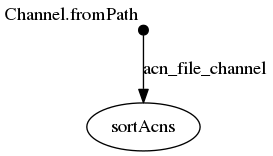

## Synopsis
Ici l'output est constituté par un `set`/`vector`/`liste` de données contenant deux objets: le nom original du fichier et le nom du fichier après le trie.

```
 output:
                set acnFile, file("${acnFile}.sorted.txt")
```


## nextflow

### ./workflow.nf

```groovy
acn_file_channel = Channel.fromPath( "${params.acns}")

process sortAcns {
	tag "sorting ${acnFile}"
	input:
		file acnFile from acn_file_channel
	output:
		set acnFile, file("${acnFile}.sorted.txt")
	script:
	
	"""
	sort '${acnFile}' > "${acnFile}.sorted.txt"
	"""
}
```


## Execute

```
../bin/nextflow run -resume -with-trace trace.tsv -with-report report.html -with-timeline timeline.html -with-dag flowchart.png workflow.nf --acns '../data/list*.acns.txt'
N E X T F L O W  ~  version 0.31.1
Launching `workflow.nf` [tiny_meucci] - revision: efdcb56eb1
[warm up] executor > local
[37/f120d7] Submitted process > sortAcns (sorting list4.acns.txt)
[59/db35c9] Submitted process > sortAcns (sorting list3.acns.txt)
[47/36df62] Submitted process > sortAcns (sorting list2.acns.txt)
[49/38e8e4] Submitted process > sortAcns (sorting list1.acns.txt)
```


## Files

```
work/59/db35c920c0fc2f86f2d17cdfa1c4ca/list3.acns.txt
work/59/db35c920c0fc2f86f2d17cdfa1c4ca/list3.acns.txt.sorted.txt
work/37/f120d793451005ccbb5d40d16633b8/list4.acns.txt.sorted.txt
work/37/f120d793451005ccbb5d40d16633b8/list4.acns.txt
work/49/38e8e41dc64e29a7387ec57d1db501/list1.acns.txt.sorted.txt
work/49/38e8e41dc64e29a7387ec57d1db501/list1.acns.txt
work/47/36df62b51d61e795a13ce1abc3bc90/list2.acns.txt.sorted.txt
work/47/36df62b51d61e795a13ce1abc3bc90/list2.acns.txt
```


## Workflow




## Trace

```
task_id	hash	native_id	name	status	exit	submit	duration	realtime	%cpu	rss	vmem	rchar	wchar
2	37/f120d7	6669	sortAcns (sorting list4.acns.txt)	COMPLETED	0	2018-11-06 10:56:14.735	812ms	23ms	0.0%	0	0	0	0
1	59/db35c9	6705	sortAcns (sorting list3.acns.txt)	COMPLETED	0	2018-11-06 10:56:15.283	468ms	45ms	0.0%	0	0	0	0
3	47/36df62	6783	sortAcns (sorting list2.acns.txt)	COMPLETED	0	2018-11-06 10:56:15.572	519ms	81ms	0.0%	0	0	0	0
4	49/38e8e4	6818	sortAcns (sorting list1.acns.txt)	COMPLETED	0	2018-11-06 10:56:15.769	341ms	24ms	0.0%	0	0	0	0
```

