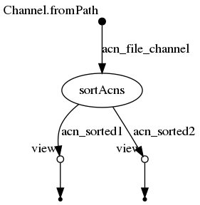

## Synopsis

un flux de données ne peut être utilisé qu'une seule fois dans un worfklow. Pour l'utiliser deux fois il faut le dupliquer.


```
(...) into (acn_sorted1,acn_sorted2)
```

## nextflow

### ./workflow.nf

```groovy
  1   acn_file_channel = Channel.fromPath( "${params.acns}")
  2   
  3   process sortAcns {
  4   	tag "sorting ${acnFile}"
  5   	input:
  6   		file acnFile from acn_file_channel
  7   	output:
  8   		set acnFile, file("${acnFile}.sorted.txt") into (acn_sorted1,acn_sorted2)
  9   	script:
 10   	
 11   	"""
 12   	sort '${acnFile}' > "${acnFile}.sorted.txt"
 13   	"""
 14   }
 15   
 16   // https://www.nextflow.io/docs/latest/operator.html#view
 17   
 18   acn_sorted1.view{F->"CHANNEL 1 : "+F}
 19   
 20   acn_sorted2.view{F->"CHANNEL 2 : "+F}
```


## Execute

```
../bin/nextflow run -resume -with-trace trace.tsv -with-report report.html -with-timeline timeline.html -with-dag flowchart.png workflow.nf --acns '../data/list*.acns.txt'
N E X T F L O W  ~  version 0.31.1
Launching `workflow.nf` [peaceful_jepsen] - revision: 699d554f84
[warm up] executor > local
[54/6855e9] Submitted process > sortAcns (sorting list4.acns.txt)
[3e/8de4da] Submitted process > sortAcns (sorting list2.acns.txt)
[12/9ba80d] Submitted process > sortAcns (sorting list3.acns.txt)
CHANNEL 1 : [list4.acns.txt, /home/lindenb/src/tuto-nextflow/0110_copy_channel/work/54/6855e9c434fdf9c6610035cf519edc/list4.acns.txt.sorted.txt]
CHANNEL 2 : [list4.acns.txt, /home/lindenb/src/tuto-nextflow/0110_copy_channel/work/54/6855e9c434fdf9c6610035cf519edc/list4.acns.txt.sorted.txt]
[e5/de0f17] Submitted process > sortAcns (sorting list1.acns.txt)
CHANNEL 2 : [list2.acns.txt, /home/lindenb/src/tuto-nextflow/0110_copy_channel/work/3e/8de4da9e1c9a316ea68c4c2120ba94/list2.acns.txt.sorted.txt]
CHANNEL 1 : [list2.acns.txt, /home/lindenb/src/tuto-nextflow/0110_copy_channel/work/3e/8de4da9e1c9a316ea68c4c2120ba94/list2.acns.txt.sorted.txt]
CHANNEL 2 : [list3.acns.txt, /home/lindenb/src/tuto-nextflow/0110_copy_channel/work/12/9ba80d0d51efe08d856842409f0cef/list3.acns.txt.sorted.txt]
CHANNEL 1 : [list3.acns.txt, /home/lindenb/src/tuto-nextflow/0110_copy_channel/work/12/9ba80d0d51efe08d856842409f0cef/list3.acns.txt.sorted.txt]
CHANNEL 1 : [list1.acns.txt, /home/lindenb/src/tuto-nextflow/0110_copy_channel/work/e5/de0f17bae27d902cec77627137d856/list1.acns.txt.sorted.txt]
CHANNEL 2 : [list1.acns.txt, /home/lindenb/src/tuto-nextflow/0110_copy_channel/work/e5/de0f17bae27d902cec77627137d856/list1.acns.txt.sorted.txt]
```


## Files

```
work/3e/8de4da9e1c9a316ea68c4c2120ba94/list2.acns.txt.sorted.txt
work/3e/8de4da9e1c9a316ea68c4c2120ba94/list2.acns.txt
work/12/9ba80d0d51efe08d856842409f0cef/list3.acns.txt
work/12/9ba80d0d51efe08d856842409f0cef/list3.acns.txt.sorted.txt
work/e5/de0f17bae27d902cec77627137d856/list1.acns.txt.sorted.txt
work/e5/de0f17bae27d902cec77627137d856/list1.acns.txt
work/54/6855e9c434fdf9c6610035cf519edc/list4.acns.txt.sorted.txt
work/54/6855e9c434fdf9c6610035cf519edc/list4.acns.txt
```


## Workflow




## Trace

```
task_id	hash	native_id	name	status	exit	submit	duration	realtime	%cpu	rss	vmem	rchar	wchar
2	54/6855e9	16324	sortAcns (sorting list4.acns.txt)	COMPLETED	0	2018-11-07 10:10:47.464	553ms	40ms	0.0%	0	0	0	0
3	3e/8de4da	16333	sortAcns (sorting list2.acns.txt)	COMPLETED	0	2018-11-07 10:10:47.583	602ms	39ms	0.0%	0	0	0	0
1	12/9ba80d	16448	sortAcns (sorting list3.acns.txt)	COMPLETED	0	2018-11-07 10:10:48.066	541ms	38ms	0.0%	0	0	0	0
4	e5/de0f17	16475	sortAcns (sorting list1.acns.txt)	COMPLETED	0	2018-11-07 10:10:48.210	481ms	41ms	0.0%	0	0	0	0
```

