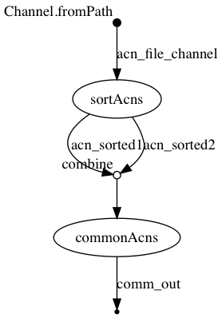

## nextflow

### ./workflow.nf

```groovy
acn_file_channel = Channel.fromPath( "${params.acns}")

process sortAcns {
	tag "sorting ${acnFile}"
	input:
		file acnFile from acn_file_channel
	output:
		set acnFile, file("${acnFile}.sorted.txt") into (acn_sorted1,acn_sorted2)
	script:
	
	"""
	sort '${acnFile}' > "${acnFile}.sorted.txt"
	"""
}

process commonAcns {
	tag "comm ${sorted1.getName()} and ${sorted2.getName()}"
	input:
		set acn1,sorted1,acn2,sorted2 from acn_sorted1.combine(acn_sorted2)
	output:
		set acn1,acn2,file("comm.txt")
	script:
	"""
	comm -12 "${sorted1}" "${sorted2}" > comm.txt
	"""
}
```


## Execute

```
../bin/nextflow run -with-trace trace.tsv -with-report report.html -with-timeline timeline.html -with-dag flowchart.png workflow.nf --acns '../data/list*.acns.txt'
N E X T F L O W  ~  version 0.32.0
Launching `workflow.nf` [berserk_cori] - revision: 58a06a28ba
[warm up] executor > local
[94/0bbf80] Submitted process > sortAcns (sorting list1.acns.txt)
[f1/2e7c0d] Submitted process > sortAcns (sorting list4.acns.txt)
[8f/cd8b70] Submitted process > sortAcns (sorting list3.acns.txt)
[77/d746a6] Submitted process > sortAcns (sorting list2.acns.txt)
ERROR ~ Error executing process > 'commonAcns (comm list4.acns.txt.sorted.txt and list4.acns.txt.sorted.txt)'

Caused by:
  java.nio.file.ProviderMismatchException


 -- Check '.nextflow.log' file for details
WARN: Killing pending tasks (2)
Makefile:4: recipe for target 'all' failed
make[1]: *** [all] Error 1
```


## Files

```
work/f1/2e7c0d7b50fd16d698e3c6b8af03b4/list4.acns.txt
work/f1/2e7c0d7b50fd16d698e3c6b8af03b4/list4.acns.txt.sorted.txt
work/77/d746a6ba85a52b2bca4c6499708a53/list2.acns.txt
work/77/d746a6ba85a52b2bca4c6499708a53/list2.acns.txt.sorted.txt
work/8f/cd8b70f22a52f78d5b194c7059aee3/list3.acns.txt
work/8f/cd8b70f22a52f78d5b194c7059aee3/list3.acns.txt.sorted.txt
work/94/0bbf8015956679e17672231696087a/list1.acns.txt
work/94/0bbf8015956679e17672231696087a/list1.acns.txt.sorted.txt
```


## Workflow




## Trace

```
task_id	hash	native_id	name	status	exit	submit	duration	realtime	%cpu	rss	vmem	rchar	wchar
4	f1/2e7c0d	32638	sortAcns (sorting list4.acns.txt)	COMPLETED	0	2018-09-28 13:14:40.657	430ms	42ms	0.0%	0	0	0	0
3	8f/cd8b70	32644	sortAcns (sorting list3.acns.txt)	COMPLETED	0	2018-09-28 13:14:40.689	463ms	57ms	0.0%	0	0	0	0
1	94/0bbf80	32635	sortAcns (sorting list1.acns.txt)	ABORTED	-	2018-09-28 13:14:40.619	-	-	-	-	-	-	-
2	77/d746a6	32654	sortAcns (sorting list2.acns.txt)	ABORTED	-	2018-09-28 13:14:40.706	-	-	-	-	-	-	-
```

