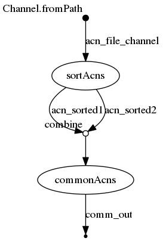

## Synopsis

> The combine operator combines (cartesian product) the items emitted by two channels.

Ici c'est le premier workflow où nous combinons deux `process`.

## nextflow

### ./workflow.nf

```groovy
  1   acn_file_channel = Channel.fromPath( "${params.acns}")
  2   
  3   process sortAcns {
  4   	tag "sorting ${acnFile}"
  5   	input:
  6   		file acnFile from acn_file_channel
  7   	output:
  8   		set acnFile, file("${acnFile}.sorted.txt") into (acn_sorted1,acn_sorted2)
  9   	script:
 10   	
 11   	"""
 12   	sort '${acnFile}' > "${acnFile}.sorted.txt"
 13   	"""
 14   }
 15   
 16   process commonAcns {
 17   	tag "comm ${sorted1.getName()} and ${sorted2.getName()}"
 18   	input:
 19   		set acn1,sorted1,acn2,sorted2 from acn_sorted1.
 20   			combine(acn_sorted2)
 21   	output:
 22   		set acn1,acn2,file("comm.txt") into comm_out
 23   	script:
 24   	"""
 25   	comm -12 "${sorted1}" "${sorted2}" > comm.txt
 26   	"""
 27   }
```


## Execute

```
../bin/nextflow run -resume -with-trace trace.tsv -with-report report.html -with-timeline timeline.html -with-dag flowchart.png workflow.nf --acns '../data/list*.acns.txt'
N E X T F L O W  ~  version 0.31.1
Launching `workflow.nf` [distracted_kalman] - revision: 0fdc53866d
[warm up] executor > local
[a2/d5eda9] Submitted process > sortAcns (sorting list4.acns.txt)
[d8/178946] Submitted process > sortAcns (sorting list3.acns.txt)
[9d/3d7781] Submitted process > sortAcns (sorting list2.acns.txt)
[f2/791801] Submitted process > sortAcns (sorting list1.acns.txt)
[ad/c73be8] Submitted process > commonAcns (comm list4.acns.txt.sorted.txt and list4.acns.txt.sorted.txt)
[77/f5323d] Submitted process > commonAcns (comm list4.acns.txt.sorted.txt and list3.acns.txt.sorted.txt)
[ba/ca90f5] Submitted process > commonAcns (comm list3.acns.txt.sorted.txt and list3.acns.txt.sorted.txt)
[c1/a915cc] Submitted process > commonAcns (comm list3.acns.txt.sorted.txt and list4.acns.txt.sorted.txt)
[c3/a2dde1] Submitted process > commonAcns (comm list4.acns.txt.sorted.txt and list2.acns.txt.sorted.txt)
[d9/9189bb] Submitted process > commonAcns (comm list3.acns.txt.sorted.txt and list2.acns.txt.sorted.txt)
[fd/105f43] Submitted process > commonAcns (comm list2.acns.txt.sorted.txt and list3.acns.txt.sorted.txt)
[44/25d007] Submitted process > commonAcns (comm list2.acns.txt.sorted.txt and list4.acns.txt.sorted.txt)
[66/28fc36] Submitted process > commonAcns (comm list2.acns.txt.sorted.txt and list2.acns.txt.sorted.txt)
[e8/b389d5] Submitted process > commonAcns (comm list1.acns.txt.sorted.txt and list3.acns.txt.sorted.txt)
[bb/5f2007] Submitted process > commonAcns (comm list1.acns.txt.sorted.txt and list4.acns.txt.sorted.txt)
[fe/d4bae9] Submitted process > commonAcns (comm list4.acns.txt.sorted.txt and list1.acns.txt.sorted.txt)
[1f/9c1c29] Submitted process > commonAcns (comm list1.acns.txt.sorted.txt and list2.acns.txt.sorted.txt)
[42/021e9b] Submitted process > commonAcns (comm list2.acns.txt.sorted.txt and list1.acns.txt.sorted.txt)
[42/65701e] Submitted process > commonAcns (comm list1.acns.txt.sorted.txt and list1.acns.txt.sorted.txt)
[29/22ce88] Submitted process > commonAcns (comm list3.acns.txt.sorted.txt and list1.acns.txt.sorted.txt)
```


## Files

```
work/c3/a2dde17d5adb9297cde543037e01e0/comm.txt
work/d8/17894647d00cb707b48cab66c78bc4/list3.acns.txt
work/d8/17894647d00cb707b48cab66c78bc4/list3.acns.txt.sorted.txt
work/ba/ca90f5d13a2214f8e195382793faae/comm.txt
work/44/25d007db170620ab22a3b23ecfd923/comm.txt
work/9d/3d7781c39fde2aa34413886c6390b7/list2.acns.txt.sorted.txt
work/9d/3d7781c39fde2aa34413886c6390b7/list2.acns.txt
work/f2/7918019c161dde6686ca1ebc2c7fe8/list1.acns.txt.sorted.txt
work/f2/7918019c161dde6686ca1ebc2c7fe8/list1.acns.txt
work/77/f5323d8454770a81a8a0b53e42462e/comm.txt
work/29/22ce88b42789b6ea1db490f85e376b/comm.txt
work/d9/9189bb891f487a7f62153db16f34f5/comm.txt
work/bb/5f20070c06fc5555cb85e3678be27e/comm.txt
work/a2/d5eda93055b60258c8367ee99c60d5/list4.acns.txt.sorted.txt
work/a2/d5eda93055b60258c8367ee99c60d5/list4.acns.txt
work/e8/b389d5388a24c4908114f1ea59d8db/comm.txt
work/1f/9c1c2976b5610aa246fab6063a7165/comm.txt
work/c1/a915cc0949f657dc4696280c489fb0/comm.txt
work/42/021e9be29fe338f6e1b4448670f33f/comm.txt
work/42/65701ee4cf2d51c6bf1347d609cbea/comm.txt
work/fd/105f439428ecf933b00eb571e2b31e/comm.txt
work/ad/c73be86ff68f2a0692edbdd05d34a6/comm.txt
work/66/28fc3659bafc40a0ff4859ef809a0e/comm.txt
work/fe/d4bae93157596002cf1c46e00e2099/comm.txt
```


## Workflow




## Trace

```
task_id	hash	native_id	name	status	exit	submit	duration	realtime	%cpu	rss	vmem	rchar	wchar
2	a2/d5eda9	12711	sortAcns (sorting list4.acns.txt)	COMPLETED	0	2018-11-08 15:29:32.023	482ms	25ms	0.0%	0	0	0	0
1	d8/178946	12720	sortAcns (sorting list3.acns.txt)	COMPLETED	0	2018-11-08 15:29:32.152	653ms	38ms	0.0%	0	0	0	0
3	9d/3d7781	12834	sortAcns (sorting list2.acns.txt)	COMPLETED	0	2018-11-08 15:29:32.531	478ms	31ms	0.0%	0	0	0	0
4	f2/791801	12892	sortAcns (sorting list1.acns.txt)	COMPLETED	0	2018-11-08 15:29:32.822	574ms	99ms	0.0%	0	0	0	0
5	ad/c73be8	12922	commonAcns (comm list4.acns.txt.sorted.txt and list4.acns.txt.sorted.txt)	COMPLETED	0	2018-11-08 15:29:33.049	434ms	61ms	0.0%	0	0	0	0
8	ba/ca90f5	13025	commonAcns (comm list3.acns.txt.sorted.txt and list3.acns.txt.sorted.txt)	COMPLETED	0	2018-11-08 15:29:33.500	294ms	23ms	0.0%	0	0	0	0
7	77/f5323d	13017	commonAcns (comm list4.acns.txt.sorted.txt and list3.acns.txt.sorted.txt)	COMPLETED	0	2018-11-08 15:29:33.456	439ms	56ms	0.0%	0	0	0	0
6	c1/a915cc	13137	commonAcns (comm list3.acns.txt.sorted.txt and list4.acns.txt.sorted.txt)	COMPLETED	0	2018-11-08 15:29:33.814	463ms	37ms	0.0%	0	0	0	0
10	c3/a2dde1	13154	commonAcns (comm list4.acns.txt.sorted.txt and list2.acns.txt.sorted.txt)	COMPLETED	0	2018-11-08 15:29:33.911	453ms	36ms	0.0%	0	0	0	0
12	fd/105f43	13273	commonAcns (comm list2.acns.txt.sorted.txt and list3.acns.txt.sorted.txt)	COMPLETED	0	2018-11-08 15:29:34.372	337ms	23ms	0.0%	0	0	0	0
9	d9/9189bb	13256	commonAcns (comm list3.acns.txt.sorted.txt and list2.acns.txt.sorted.txt)	COMPLETED	0	2018-11-08 15:29:34.285	524ms	45ms	0.0%	0	0	0	0
11	44/25d007	13375	commonAcns (comm list2.acns.txt.sorted.txt and list4.acns.txt.sorted.txt)	COMPLETED	0	2018-11-08 15:29:34.719	215ms	4ms	0.0%	0	0	0	0
13	66/28fc36	13433	commonAcns (comm list2.acns.txt.sorted.txt and list2.acns.txt.sorted.txt)	COMPLETED	0	2018-11-08 15:29:34.823	304ms	27ms	0.0%	0	0	0	0
14	e8/b389d5	13470	commonAcns (comm list1.acns.txt.sorted.txt and list3.acns.txt.sorted.txt)	COMPLETED	0	2018-11-08 15:29:34.948	277ms	22ms	0.0%	0	0	0	0
15	bb/5f2007	13551	commonAcns (comm list1.acns.txt.sorted.txt and list4.acns.txt.sorted.txt)	COMPLETED	0	2018-11-08 15:29:35.137	171ms	5ms	0.0%	0	0	0	0
16	1f/9c1c29	13668	commonAcns (comm list1.acns.txt.sorted.txt and list2.acns.txt.sorted.txt)	COMPLETED	0	2018-11-08 15:29:35.316	54ms	2ms	-	-	-	-	-
17	fe/d4bae9	13610	commonAcns (comm list4.acns.txt.sorted.txt and list1.acns.txt.sorted.txt)	COMPLETED	0	2018-11-08 15:29:35.246	200ms	8ms	0.0%	0	0	0	0
18	42/021e9b	13696	commonAcns (comm list2.acns.txt.sorted.txt and list1.acns.txt.sorted.txt)	COMPLETED	0	2018-11-08 15:29:35.374	234ms	5ms	0.0%	0	0	0	0
19	42/65701e	13754	commonAcns (comm list1.acns.txt.sorted.txt and list1.acns.txt.sorted.txt)	COMPLETED	0	2018-11-08 15:29:35.459	208ms	19ms	0.0%	0	0	0	0
20	29/22ce88	13814	commonAcns (comm list3.acns.txt.sorted.txt and list1.acns.txt.sorted.txt)	COMPLETED	0	2018-11-08 15:29:35.615	229ms	35ms	0.0%	0	0	0	0
```

