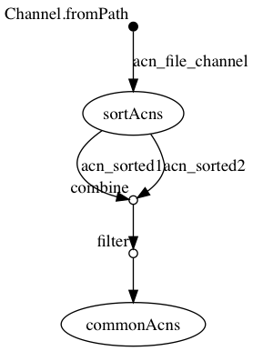

## Synopsis

> The filter operator allows you to get only the items emitted by a channel that satisfy a condition and discarding all the others. The filtering condition can be specified by using either a regular expression, a literal value, a type qualifier (i.e. a Java class) or any boolean predicate.


ici, après `combine` on ne garde que les lignes où le premier nom est 'plus petit' que le deuxième.

```
filter{ROW->ROW[1].getName().compareTo(ROW[3].getName())<0}
```

## nextflow

### ./workflow.nf

```groovy
  1   acn_file_channel = Channel.fromPath( "${params.acns}")
  2   
  3   process sortAcns {
  4   	tag "sorting ${acnFile}"
  5   	input:
  6   		file acnFile from acn_file_channel
  7   	output:
  8   		set acnFile, file("${acnFile}.sorted.txt") into (acn_sorted1,acn_sorted2)
  9   	script:
 10   	
 11   	"""
 12   	sort '${acnFile}' > "${acnFile}.sorted.txt"
 13   	"""
 14   }
 15   
 16   process commonAcns {
 17   	tag "comm ${sorted1.getName()} and ${sorted2.getName()}"
 18   	input:
 19   		set acn1,sorted1,acn2,sorted2 from acn_sorted1.
 20                                             combine(acn_sorted2).
 21                                             filter{ROW->ROW[1].getName().compareTo(ROW[3].getName())<0}
 22   	output:
 23   		set acn1,acn2,file("comm.txt")
 24   	script:
 25   	"""
 26   	comm -12 "${sorted1}" "${sorted2}" > comm.txt
 27   	"""
 28   }
```


## Execute

```
../bin/nextflow run -resume -with-trace trace.tsv -with-report report.html -with-timeline timeline.html -with-dag flowchart.png workflow.nf --acns '../data/list*.acns.txt'
N E X T F L O W  ~  version 0.31.1
Launching `workflow.nf` [special_tuckerman] - revision: 41d209f8fc
[warm up] executor > local
[f9/f8f00f] Submitted process > sortAcns (sorting list4.acns.txt)
[5d/0c6d2a] Submitted process > sortAcns (sorting list3.acns.txt)
[ee/26ed46] Submitted process > sortAcns (sorting list1.acns.txt)
[b1/f2ef87] Submitted process > sortAcns (sorting list2.acns.txt)
[b7/a14434] Submitted process > commonAcns (comm list3.acns.txt.sorted.txt and list4.acns.txt.sorted.txt)
[3d/b538bb] Submitted process > commonAcns (comm list1.acns.txt.sorted.txt and list3.acns.txt.sorted.txt)
[e9/013227] Submitted process > commonAcns (comm list1.acns.txt.sorted.txt and list4.acns.txt.sorted.txt)
[75/6d530d] Submitted process > commonAcns (comm list2.acns.txt.sorted.txt and list3.acns.txt.sorted.txt)
[06/2edc75] Submitted process > commonAcns (comm list2.acns.txt.sorted.txt and list4.acns.txt.sorted.txt)
[96/840a4c] Submitted process > commonAcns (comm list1.acns.txt.sorted.txt and list2.acns.txt.sorted.txt)
```


## Files

```
work/b7/a14434e8b31976133078b3c05f498d/comm.txt
work/f9/f8f00fd0419f8692f1fada74269a56/list4.acns.txt.sorted.txt
work/f9/f8f00fd0419f8692f1fada74269a56/list4.acns.txt
work/ee/26ed46d55250f023486c028e12b35a/list1.acns.txt.sorted.txt
work/ee/26ed46d55250f023486c028e12b35a/list1.acns.txt
work/3d/b538bb54b01c62e660c9c1fbe3bd5c/comm.txt
work/75/6d530d601cfb84f0cf56ca873c69b0/comm.txt
work/96/840a4c44a46c81a52c8f605a2e51ea/comm.txt
work/5d/0c6d2ae9f4e00771e702938f19c1fa/list3.acns.txt
work/5d/0c6d2ae9f4e00771e702938f19c1fa/list3.acns.txt.sorted.txt
work/e9/013227c2892ed8b2796f91c9b2b836/comm.txt
work/06/2edc759bcdafee10e7f44ad42b73c1/comm.txt
work/b1/f2ef87ccffc9b84a65f00fe91c9e4d/list2.acns.txt.sorted.txt
work/b1/f2ef87ccffc9b84a65f00fe91c9e4d/list2.acns.txt
```


## Workflow




## Trace

```
task_id	hash	native_id	name	status	exit	submit	duration	realtime	%cpu	rss	vmem	rchar	wchar
2	f9/f8f00f	17908	sortAcns (sorting list4.acns.txt)	COMPLETED	0	2018-11-07 10:11:11.513	493ms	55ms	0.0%	0	0	0	0
1	5d/0c6d2a	17917	sortAcns (sorting list3.acns.txt)	COMPLETED	0	2018-11-07 10:11:11.614	555ms	37ms	0.0%	0	0	0	0
3	ee/26ed46	18032	sortAcns (sorting list1.acns.txt)	COMPLETED	0	2018-11-07 10:11:12.055	597ms	54ms	0.0%	0	0	0	0
4	b1/f2ef87	18042	sortAcns (sorting list2.acns.txt)	COMPLETED	0	2018-11-07 10:11:12.194	510ms	58ms	0.0%	0	0	0	0
5	b7/a14434	18156	commonAcns (comm list3.acns.txt.sorted.txt and list4.acns.txt.sorted.txt)	COMPLETED	0	2018-11-07 10:11:12.679	433ms	33ms	0.0%	0	0	0	0
6	3d/b538bb	18157	commonAcns (comm list1.acns.txt.sorted.txt and list3.acns.txt.sorted.txt)	COMPLETED	0	2018-11-07 10:11:12.714	458ms	41ms	0.0%	0	0	0	0
7	e9/013227	18274	commonAcns (comm list1.acns.txt.sorted.txt and list4.acns.txt.sorted.txt)	COMPLETED	0	2018-11-07 10:11:13.132	319ms	54ms	0.0%	0	0	0	0
8	75/6d530d	18297	commonAcns (comm list2.acns.txt.sorted.txt and list3.acns.txt.sorted.txt)	COMPLETED	0	2018-11-07 10:11:13.182	334ms	25ms	0.0%	0	0	0	0
10	96/840a4c	18420	commonAcns (comm list1.acns.txt.sorted.txt and list2.acns.txt.sorted.txt)	COMPLETED	0	2018-11-07 10:11:13.521	343ms	17ms	0.0%	0	0	0	0
9	06/2edc75	18391	commonAcns (comm list2.acns.txt.sorted.txt and list4.acns.txt.sorted.txt)	COMPLETED	0	2018-11-07 10:11:13.469	496ms	10ms	0.0%	0	0	0	0
```

