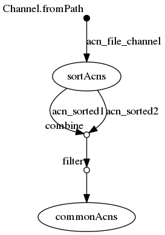

## nextflow

### ./workflow.nf

```groovy
acn_file_channel = Channel.fromPath( "${params.acns}")

process sortAcns {
	tag "sorting ${acnFile}"
	input:
		file acnFile from acn_file_channel
	output:
		set acnFile, file("${acnFile}.sorted.txt") into (acn_sorted1,acn_sorted2)
	script:
	
	"""
	sort '${acnFile}' > "${acnFile}.sorted.txt"
	"""
}

process commonAcns {
	tag "comm ${sorted1.getName()} and ${sorted2.getName()}"
	input:
		set acn1,sorted1,acn2,sorted2 from acn_sorted1.
                                          combine(acn_sorted2).
                                          filter{ROW->ROW[1].getName().compareTo(ROW[3].getName())<0}
	output:
		set acn1,acn2,file("comm.txt")
	script:
	"""
	comm -12 "${sorted1}" "${sorted2}" > comm.txt
	"""
}
```


## Execute

```
../bin/nextflow run -with-trace trace.tsv -with-report report.html -with-timeline timeline.html -with-dag flowchart.png workflow.nf --acns '../data/list*.acns.txt'
N E X T F L O W  ~  version 0.32.0
Launching `workflow.nf` [happy_mestorf] - revision: 41d209f8fc
[warm up] executor > local
[1b/a0b2e1] Submitted process > sortAcns (sorting list3.acns.txt)
[5f/2e1a9c] Submitted process > sortAcns (sorting list1.acns.txt)
[ae/0a7064] Submitted process > sortAcns (sorting list4.acns.txt)
[a5/69e3c0] Submitted process > sortAcns (sorting list2.acns.txt)
ERROR ~ Error executing process > 'commonAcns (comm list1.acns.txt.sorted.txt and list3.acns.txt.sorted.txt)'

Caused by:
  java.nio.file.ProviderMismatchException


 -- Check '.nextflow.log' file for details
Makefile:4: recipe for target 'all' failed
make[1]: *** [all] Error 1
```


## Files

```
work/a5/69e3c097a0e885bf49906dc3b26d06/list2.acns.txt
work/a5/69e3c097a0e885bf49906dc3b26d06/list2.acns.txt.sorted.txt
work/1b/a0b2e1ce35cf6c209c3955883b27cb/list3.acns.txt
work/1b/a0b2e1ce35cf6c209c3955883b27cb/list3.acns.txt.sorted.txt
work/ae/0a706405727cf7cf5c1b85229aaf35/list4.acns.txt
work/ae/0a706405727cf7cf5c1b85229aaf35/list4.acns.txt.sorted.txt
work/5f/2e1a9c53db6610d6035eeb9d6dae00/list1.acns.txt
work/5f/2e1a9c53db6610d6035eeb9d6dae00/list1.acns.txt.sorted.txt
```


## Workflow




## Trace

```
task_id	hash	native_id	name	status	exit	submit	duration	realtime	%cpu	rss	vmem	rchar	wchar
3	1b/a0b2e1	577	sortAcns (sorting list3.acns.txt)	COMPLETED	0	2018-09-28 13:14:45.113	455ms	50ms	0.0%	0	0	0	0
1	5f/2e1a9c	580	sortAcns (sorting list1.acns.txt)	COMPLETED	0	2018-09-28 13:14:45.143	478ms	46ms	0.0%	0	0	0	0
4	ae/0a7064	585	sortAcns (sorting list4.acns.txt)	COMPLETED	0	2018-09-28 13:14:45.159	479ms	45ms	0.0%	0	0	0	0
2	a5/69e3c0	591	sortAcns (sorting list2.acns.txt)	COMPLETED	0	2018-09-28 13:14:45.172	471ms	34ms	0.0%	0	0	0	0
```

