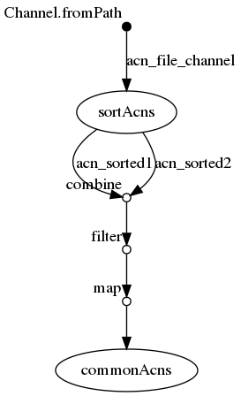

## Synopsis

> The map operator applies a function of your choosing to every item emitted by a channel, and returns the items so obtained as a new channel. The function applied is called the mapping function and is expressed with a closure

Ici

```
map{ROW->[ ROW[0].getName() + " vs " + ROW[2].getName() , ROW[1] , ROW[3] ] }
```

on crée un tableau à trois elements : le titre , fichier trié 1, fichier trié 2


## nextflow

### ./workflow.nf

```groovy
  1   acn_file_channel = Channel.fromPath( "${params.acns}")
  2   
  3   process sortAcns {
  4   	tag "sorting ${acnFile}"
  5   	input:
  6   		file acnFile from acn_file_channel
  7   	output:
  8   		set acnFile, file("${acnFile}.sorted.txt") into (acn_sorted1,acn_sorted2)
  9   	script:
 10   	
 11   	"""
 12   	sort '${acnFile}' > "${acnFile}.sorted.txt"
 13   	"""
 14   }
 15   
 16   process commonAcns {
 17   	tag "comm ${label}"
 18   	input:
 19   		set label,sorted1,sorted2 from acn_sorted1.
 20                                             combine(acn_sorted2).
 21                                             filter{ROW->ROW[0].getName().compareTo(ROW[2].getName())<0}.
 22   					  map{ROW->[ ROW[0].getName() + " vs " + ROW[2].getName() , ROW[1] , ROW[3] ] }
 23   	output:
 24   		set label,file("comm.txt")
 25   	script:
 26   	"""
 27   	comm -12 "${sorted1}" "${sorted2}" > comm.txt
 28   	"""
 29   }
```


## Execute

```
../bin/nextflow run -resume -with-trace trace.tsv -with-report report.html -with-timeline timeline.html -with-dag flowchart.png workflow.nf --acns '../data/list*.acns.txt'
N E X T F L O W  ~  version 0.31.1
Launching `workflow.nf` [berserk_shockley] - revision: 50561d3246
[warm up] executor > local
[3a/5a3670] Submitted process > sortAcns (sorting list4.acns.txt)
[da/26776d] Submitted process > sortAcns (sorting list3.acns.txt)
[c8/c1e9f0] Submitted process > sortAcns (sorting list2.acns.txt)
[df/dafc28] Submitted process > sortAcns (sorting list1.acns.txt)
[36/8429d3] Submitted process > commonAcns (comm list3.acns.txt vs list4.acns.txt)
[2c/76bf7e] Submitted process > commonAcns (comm list2.acns.txt vs list3.acns.txt)
[cc/765bf7] Submitted process > commonAcns (comm list2.acns.txt vs list4.acns.txt)
[c3/84a0ac] Submitted process > commonAcns (comm list1.acns.txt vs list3.acns.txt)
[87/0bb7dc] Submitted process > commonAcns (comm list1.acns.txt vs list4.acns.txt)
[1c/0e9cff] Submitted process > commonAcns (comm list1.acns.txt vs list2.acns.txt)
```


## Files

```
work/1c/0e9cff4582f5a5a4c9eaf9fd14dd4d/comm.txt
work/c3/84a0acaa435cd60feb682ef56abda3/comm.txt
work/cc/765bf71ca95a9426da7bd7b312fa64/comm.txt
work/36/8429d332b749c24366960828abda4c/comm.txt
work/c8/c1e9f0255063f93349022edd143185/list2.acns.txt.sorted.txt
work/c8/c1e9f0255063f93349022edd143185/list2.acns.txt
work/da/26776d1d143b2fdb5e6a4fc3b69c87/list3.acns.txt
work/da/26776d1d143b2fdb5e6a4fc3b69c87/list3.acns.txt.sorted.txt
work/3a/5a36708cdd8e1b827d6b5424372d24/list4.acns.txt.sorted.txt
work/3a/5a36708cdd8e1b827d6b5424372d24/list4.acns.txt
work/df/dafc28caacc205fdfecfe2a6d02bbd/list1.acns.txt.sorted.txt
work/df/dafc28caacc205fdfecfe2a6d02bbd/list1.acns.txt
work/2c/76bf7e046ba7c5882aff2b6d4bc239/comm.txt
work/87/0bb7dca5bd5e7a607d59114a0e965e/comm.txt
```


## Workflow




## Trace

```
task_id	hash	native_id	name	status	exit	submit	duration	realtime	%cpu	rss	vmem	rchar	wchar
2	3a/5a3670	18628	sortAcns (sorting list4.acns.txt)	COMPLETED	0	2018-11-07 10:11:22.649	550ms	35ms	0.0%	0	0	0	0
1	da/26776d	18638	sortAcns (sorting list3.acns.txt)	COMPLETED	0	2018-11-07 10:11:22.767	659ms	63ms	0.0%	0	0	0	0
3	c8/c1e9f0	18752	sortAcns (sorting list2.acns.txt)	COMPLETED	0	2018-11-07 10:11:23.242	456ms	20ms	0.0%	0	0	0	0
4	df/dafc28	18791	sortAcns (sorting list1.acns.txt)	COMPLETED	0	2018-11-07 10:11:23.452	517ms	43ms	0.0%	0	0	0	0
5	36/8429d3	18848	commonAcns (comm list3.acns.txt vs list4.acns.txt)	COMPLETED	0	2018-11-07 10:11:23.704	930ms	30ms	0.0%	0	0	0	0
6	2c/76bf7e	18912	commonAcns (comm list2.acns.txt vs list3.acns.txt)	COMPLETED	0	2018-11-07 10:11:24.001	681ms	64ms	0.0%	0	0	0	0
8	c3/84a0ac	18996	commonAcns (comm list1.acns.txt vs list3.acns.txt)	COMPLETED	0	2018-11-07 10:11:24.711	158ms	56ms	-	-	-	-	-
7	cc/765bf7	18994	commonAcns (comm list2.acns.txt vs list4.acns.txt)	COMPLETED	0	2018-11-07 10:11:24.668	488ms	28ms	0.0%	0	0	0	0
9	87/0bb7dc	19050	commonAcns (comm list1.acns.txt vs list4.acns.txt)	COMPLETED	0	2018-11-07 10:11:24.893	360ms	48ms	0.0%	0	0	0	0
10	1c/0e9cff	19138	commonAcns (comm list1.acns.txt vs list2.acns.txt)	COMPLETED	0	2018-11-07 10:11:25.170	302ms	24ms	0.0%	0	0	0	0
```

