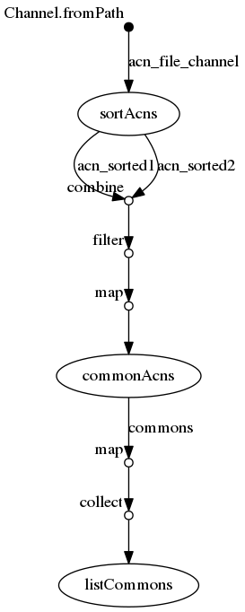

## Synopsis

> The collect operator collects all the items emitted by a channel to a List and return the resulting object as a sole emission


```
 commons.map{ROW->ROW[0]+","+ROW[1]}.collect()
```

va collecter toutes les paires 'label/path` et retourner une liste contenant l'output de chaque process précédent.


## nextflow

### ./workflow.nf

```groovy
  1   acn_file_channel = Channel.fromPath( "${params.acns}")
  2   
  3   process sortAcns {
  4   	tag "sorting ${acnFile}"
  5   	input:
  6   		file acnFile from acn_file_channel
  7   	output:
  8   		set acnFile, file("${acnFile}.sorted.txt") into (acn_sorted1,acn_sorted2)
  9   	script:
 10   	
 11   	"""
 12   	sort '${acnFile}' > "${acnFile}.sorted.txt"
 13   	"""
 14   }
 15   
 16   process commonAcns {
 17   	tag "comm ${label}"
 18   	input:
 19   		set label,sorted1,sorted2 from acn_sorted1.
 20                                             combine(acn_sorted2).
 21                                             filter{ROW->ROW[0].getName().compareTo(ROW[2].getName())<0}.
 22   					  map{ROW->[ ROW[0].getName() + " vs " + ROW[2].getName() , ROW[1] , ROW[3] ] }
 23   	output:
 24   		set label,file("comm.txt") into commons
 25   	script:
 26   	"""
 27   	comm -12 "${sorted1}" "${sorted2}" > comm.txt
 28   	"""
 29   }
 30   
 31   process listCommons {
 32   	tag "common list size: ${array_of_rows.size()}"
 33   	input:
 34   		val array_of_rows from commons.map{ROW->ROW[0]+","+ROW[1]}.collect()
 35   	output:
 36   		file("table.csv")
 37   		file("distinct.acns.txt")
 38   	script:
 39   	"""
 40   	## table.csv est un fichier tsv. 1st column: label, 2nd column: path to file of common acns
 41   	echo '${array_of_rows.join("\n")}' > table.csv
 42   	
 43   	## loop over each path in the second file , concatenate and extract the uniq
 44   	cut -d ',' -f2 table.csv | while read F
 45   	do
 46   		cat \$F
 47   	done | sort | uniq > distinct.acns.txt
 48   	"""
 49   
 50   }
```


## Execute

```
../bin/nextflow run -resume -with-trace trace.tsv -with-report report.html -with-timeline timeline.html -with-dag flowchart.png workflow.nf --acns '../data/list*.acns.txt'
N E X T F L O W  ~  version 0.31.1
Launching `workflow.nf` [insane_venter] - revision: eea5eea3ad
[warm up] executor > local
[7f/6d79e3] Submitted process > sortAcns (sorting list3.acns.txt)
[53/c535e8] Submitted process > sortAcns (sorting list2.acns.txt)
[a4/ebdadf] Submitted process > sortAcns (sorting list4.acns.txt)
[1c/3712cc] Submitted process > sortAcns (sorting list1.acns.txt)
[56/b3dd70] Submitted process > commonAcns (comm list2.acns.txt vs list3.acns.txt)
[47/14930d] Submitted process > commonAcns (comm list1.acns.txt vs list3.acns.txt)
[2e/8bf570] Submitted process > commonAcns (comm list3.acns.txt vs list4.acns.txt)
[56/f73572] Submitted process > commonAcns (comm list1.acns.txt vs list2.acns.txt)
[83/4883ba] Submitted process > commonAcns (comm list2.acns.txt vs list4.acns.txt)
[66/2d9c7b] Submitted process > commonAcns (comm list1.acns.txt vs list4.acns.txt)
[31/e514c4] Submitted process > listCommons (common list size: 6)
```


## Files

```
work/7f/6d79e3f15ec3b2ae5fa22a53654526/list3.acns.txt
work/7f/6d79e3f15ec3b2ae5fa22a53654526/list3.acns.txt.sorted.txt
work/1c/3712ccdb122e1425fd552a67f155bf/list1.acns.txt.sorted.txt
work/1c/3712ccdb122e1425fd552a67f155bf/list1.acns.txt
work/31/e514c4d9fbbd5d850e8ca447a29375/distinct.acns.txt
work/31/e514c4d9fbbd5d850e8ca447a29375/table.csv
work/a4/ebdadfc99970b7f4b12dfbedbdf5ba/list4.acns.txt.sorted.txt
work/a4/ebdadfc99970b7f4b12dfbedbdf5ba/list4.acns.txt
work/56/b3dd70394c3f2333b802bdb16c8723/comm.txt
work/56/f735726540cf29512b586f2f16db9f/comm.txt
work/2e/8bf570b717746aa6b8eb279211d2bd/comm.txt
work/83/4883ba0243469d490a8bcb2b9581c7/comm.txt
work/53/c535e8b40011070b3c5adefd881236/list2.acns.txt.sorted.txt
work/53/c535e8b40011070b3c5adefd881236/list2.acns.txt
work/66/2d9c7bce93e248d219a91c2653e0fe/comm.txt
work/47/14930df9b24538baf7e6f4dd6df112/comm.txt
```


## Workflow




## Trace

```
task_id	hash	native_id	name	status	exit	submit	duration	realtime	%cpu	rss	vmem	rchar	wchar
1	7f/6d79e3	19286	sortAcns (sorting list3.acns.txt)	COMPLETED	0	2018-11-07 10:11:34.015	388ms	28ms	0.0%	0	0	0	0
3	53/c535e8	19294	sortAcns (sorting list2.acns.txt)	COMPLETED	0	2018-11-07 10:11:34.146	351ms	33ms	0.0%	0	0	0	0
4	1c/3712cc	19424	sortAcns (sorting list1.acns.txt)	COMPLETED	0	2018-11-07 10:11:34.525	163ms	44ms	-	-	-	-	-
2	a4/ebdadf	19410	sortAcns (sorting list4.acns.txt)	COMPLETED	0	2018-11-07 10:11:34.440	613ms	37ms	0.0%	0	0	0	0
5	56/b3dd70	19502	commonAcns (comm list2.acns.txt vs list3.acns.txt)	COMPLETED	0	2018-11-07 10:11:35.051	248ms	10ms	0.0%	0	0	0	0
7	47/14930d	19509	commonAcns (comm list1.acns.txt vs list3.acns.txt)	COMPLETED	0	2018-11-07 10:11:35.095	214ms	32ms	0.0%	0	0	0	0
6	56/f73572	19622	commonAcns (comm list1.acns.txt vs list2.acns.txt)	COMPLETED	0	2018-11-07 10:11:35.361	273ms	8ms	0.0%	0	0	0	0
8	2e/8bf570	19620	commonAcns (comm list3.acns.txt vs list4.acns.txt)	COMPLETED	0	2018-11-07 10:11:35.324	342ms	26ms	0.0%	0	0	0	0
9	83/4883ba	19737	commonAcns (comm list2.acns.txt vs list4.acns.txt)	COMPLETED	0	2018-11-07 10:11:35.644	288ms	38ms	0.0%	0	0	0	0
10	66/2d9c7b	19754	commonAcns (comm list1.acns.txt vs list4.acns.txt)	COMPLETED	0	2018-11-07 10:11:35.677	259ms	33ms	0.0%	0	0	0	0
11	31/e514c4	19856	listCommons (common list size: 6)	COMPLETED	0	2018-11-07 10:11:35.955	314ms	35ms	0.0%	0	5.4 MB	0	0
```

