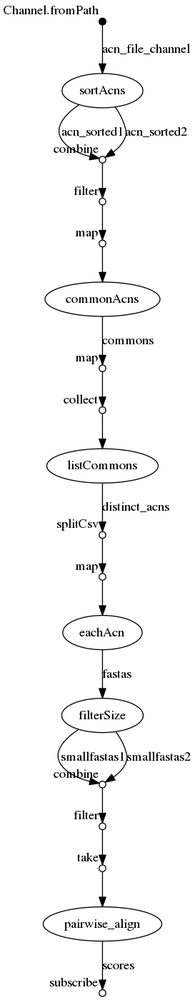

## Synopsis

> `stdout` Sends the executed process stdout over the output channel.

## nextflow

### ./workflow.nf

```groovy
  1   acn_file_channel = Channel.fromPath( "${params.acns}")
  2   
  3   process sortAcns {
  4   	tag "sorting ${acnFile}"
  5   	input:
  6   		file acnFile from acn_file_channel
  7   	output:
  8   		set acnFile, file("${acnFile}.sorted.txt") into (acn_sorted1,acn_sorted2)
  9   	script:
 10   	
 11   	"""
 12   	sort '${acnFile}' > "${acnFile}.sorted.txt"
 13   	"""
 14   }
 15   
 16   process commonAcns {
 17   	tag "comm ${label}"
 18   	input:
 19   		set label,sorted1,sorted2 from acn_sorted1.
 20                                             combine(acn_sorted2).
 21                                             filter{ROW->ROW[0].getName().compareTo(ROW[2].getName())<0}.
 22   					  map{ROW->[ ROW[0].getName() + " vs " + ROW[2].getName() , ROW[1] , ROW[3] ] }
 23   	output:
 24   		set label,file("comm.txt") into commons
 25   	script:
 26   	"""
 27   	comm -12 "${sorted1}" "${sorted2}" > comm.txt
 28   	"""
 29   }
 30   
 31   process listCommons {
 32   	tag "common list size: ${array_of_rows.size()}"
 33   	input:
 34   		val array_of_rows from commons.map{ROW->ROW[0]+","+ROW[1]}.collect()
 35   	output:
 36   		file("table.csv")
 37   		file("distinct.acns.txt") into distinct_acns
 38   	script:
 39   	"""
 40   	echo '${array_of_rows.join("\n")}' > table.csv
 41   	cut -d ',' -f2 table.csv | while read F
 42   	do
 43   		cat \$F
 44   	done | sort | uniq > distinct.acns.txt
 45   	"""
 46   
 47   }
 48   
 49   // https://www.nextflow.io/docs/latest/process.html?highlight=maxfork#maxforks
 50   process eachAcn {
 51   	tag "dowloading ${acn}"
 52   	maxForks 1
 53   	input:	
 54   		val acn from distinct_acns.splitCsv(sep:',',strip:true).map{ARRAY->ARRAY[0]}
 55   	output:
 56   		file("${acn}.fa") into fastas
 57   	script:
 58   	"""
 59   	curl -o "${acn}.fa" -f -L  "https://www.ncbi.nlm.nih.gov/entrez/eutils/efetch.fcgi?db=nucleotide&id=${acn}&rettype=fasta"
 60   	"""
 61   	}
 62   
 63   process filterSize {
 64   	tag "size for ${fasta}"
 65   
 66   	input:
 67   		file fasta from fastas
 68   	output:
 69   		file("${fasta}.small.fa") optional true into (smallfastas1,smallfastas2)
 70   	script:
 71   
 72   	"""
 73   	if [ `grep -v ">" ${fasta} | tr -d '\\n ' | wc -c` -lt 100 ]; then
 74   		cp "${fasta}"  "${fasta}.small.fa"
 75   	fi
 76   	"""
 77   	}
 78   
 79   process pairwise_align {
 80   	tag "pairwise ${fasta1} vs ${fasta2}"
 81   	maxForks 1
 82   	input:
 83   		set fasta1,fasta2 from smallfastas1.
 84   		          combine(smallfastas2).
 85   		          filter{ROW->ROW[0].getName().compareTo(ROW[1].getName())<0}.
 86   			  take(2)
 87   			  
 88   	output:
 89   		stdout scores
 90   	script:
 91   	"""
 92   	SEQ1=`grep -v ">" "${fasta1}" | tr -d "\n"`
 93   	SEQ2=`grep -v ">" "${fasta2}" | tr -d "\n"`
 94   	
 95   	echo -n "${fasta1},${fasta2},"
 96   
 97   	curl 'https://embnet.vital-it.ch/cgi-bin/LALIGN_form_parser' \
 98   		-H 'User-Agent: Mozilla/5.0 (X11; Ubuntu; Linux i686; rv:62.0) Gecko/20100101 Firefox/62.0' \
 99   		-H 'Accept: text/html,application/xhtml+xml,application/xml;q=0.9,*/*;q=0.8' -H 'Accept-Language: en-US,en;q=0.5' \
100   		--compressed \
101   		-H 'Referer: https://embnet.vital-it.ch/software/LALIGN_form.html' \
102   		-H 'Content-Type: application/x-www-form-urlencoded' \
103   		-H 'DNT: 1' \
104   		-H 'Connection: keep-alive' \
105   		-H 'Upgrade-Insecure-Requests: 1' \
106   		--data "method=global&no=1&evalue=10.0&matrix=dna&open=-12&exten=-2&comm1=seq1&format1=plain_text&seq1=\${SEQ1}&comm2=seq2&format2=plain_text&seq2=\${SEQ2}" |\
107   	xmllint --html --format --xpath '//pre[1]/text()' - |\
108   		grep -F 'Z-score:' -m1 | cut -d ':' -f 5 | tr -d ' '
109   	"""
110   	}
111   
112   scores.subscribe { print "I say..  $it" }
```


## Execute

```
../bin/nextflow run -resume -with-trace trace.tsv -with-report report.html -with-timeline timeline.html -with-dag flowchart.png workflow.nf --acns '../data/list*.acns.txt'
N E X T F L O W  ~  version 0.31.1
Launching `workflow.nf` [sick_brahmagupta] - revision: f67e476704
[warm up] executor > local
[93/b5c456] Submitted process > sortAcns (sorting list4.acns.txt)
[dd/eb5b0d] Submitted process > sortAcns (sorting list3.acns.txt)
[b3/ef8b23] Submitted process > sortAcns (sorting list2.acns.txt)
[f1/385af9] Submitted process > sortAcns (sorting list1.acns.txt)
[58/78f3a5] Submitted process > commonAcns (comm list3.acns.txt vs list4.acns.txt)
[fd/77a53b] Submitted process > commonAcns (comm list1.acns.txt vs list4.acns.txt)
[b2/f22248] Submitted process > commonAcns (comm list1.acns.txt vs list3.acns.txt)
[a1/c3acac] Submitted process > commonAcns (comm list2.acns.txt vs list4.acns.txt)
[f2/993646] Submitted process > commonAcns (comm list2.acns.txt vs list3.acns.txt)
[b6/2afa02] Submitted process > commonAcns (comm list1.acns.txt vs list2.acns.txt)
[e4/958654] Submitted process > listCommons (common list size: 6)
[67/825b86] Submitted process > eachAcn (dowloading AF002815.1)
[3c/86bccd] Submitted process > filterSize (size for AF002815.1.fa)
[7e/18dc82] Submitted process > eachAcn (dowloading AF002816.1)
[60/0321e2] Submitted process > filterSize (size for AF002816.1.fa)
[8b/1ac710] Submitted process > eachAcn (dowloading AF004836.1)
[b5/c897a5] Submitted process > filterSize (size for AF004836.1.fa)
[4b/c3b9c3] Submitted process > eachAcn (dowloading AF188126.1)
[90/2b0bbf] Submitted process > filterSize (size for AF188126.1.fa)
[53/2b6825] Submitted process > eachAcn (dowloading AF188530.1)
[54/838034] Submitted process > filterSize (size for AF188530.1.fa)
[b9/77576e] Submitted process > eachAcn (dowloading AX244961.1)
[ec/8f3d09] Submitted process > eachAcn (dowloading AX244962.1)
[62/61e9c3] Submitted process > filterSize (size for AX244961.1.fa)
[a0/336177] Submitted process > eachAcn (dowloading AX244963.1)
[3b/64435e] Submitted process > filterSize (size for AX244962.1.fa)
[45/0ec2c2] Submitted process > pairwise_align (pairwise /home/lindenb/src/tuto-nextflow/0190_stdout/work/62/61e9c3341debaac1f4ccd3a5871ef0/AX244961.1.fa.small.fa vs /home/lindenb/src/tuto-nextflow/0190_stdout/work/3b/64435ee77803d0c5e139fa467758f6/AX244962.1.fa.small.fa)
[55/c1484a] Submitted process > eachAcn (dowloading AX244964.1)
I say..  /home/lindenb/src/tuto-nextflow/0190_stdout/work/62/61e9c3341debaac1f4ccd3a5871ef0/AX244961.1.fa.small.fa,/home/lindenb/src/tuto-nextflow/0190_stdout/work/3b/64435ee77803d0c5e139fa467758f6/AX244962.1.fa.small.fa,0.6
[80/f47595] Submitted process > filterSize (size for AX244963.1.fa)
[c1/03f864] Submitted process > pairwise_align (pairwise /home/lindenb/src/tuto-nextflow/0190_stdout/work/62/61e9c3341debaac1f4ccd3a5871ef0/AX244961.1.fa.small.fa vs /home/lindenb/src/tuto-nextflow/0190_stdout/work/80/f4759526afd1fe5107a748156d193b/AX244963.1.fa.small.fa)
[1b/1b969e] Submitted process > eachAcn (dowloading AX244965.1)
I say..  /home/lindenb/src/tuto-nextflow/0190_stdout/work/62/61e9c3341debaac1f4ccd3a5871ef0/AX244961.1.fa.small.fa,/home/lindenb/src/tuto-nextflow/0190_stdout/work/80/f4759526afd1fe5107a748156d193b/AX244963.1.fa.small.fa,2e-05
[fa/72f073] Submitted process > filterSize (size for AX244964.1.fa)
[18/0535e2] Submitted process > eachAcn (dowloading AX244966.1)
[a5/e10911] Submitted process > filterSize (size for AX244965.1.fa)
[e7/c1c745] Submitted process > filterSize (size for AX244966.1.fa)
[bd/ceb7e4] Submitted process > eachAcn (dowloading AX244967.1)
[9c/6d3779] Submitted process > eachAcn (dowloading AX244968.1)
[b4/6aa022] Submitted process > filterSize (size for AX244967.1.fa)
[ee/396a73] Submitted process > filterSize (size for AX244968.1.fa)
[5b/04b90a] Submitted process > eachAcn (dowloading AY116592.1)
[15/8cc949] Submitted process > eachAcn (dowloading NM_017590.5)
[ba/817619] Submitted process > filterSize (size for AY116592.1.fa)
[2c/5e6fc5] Submitted process > filterSize (size for NM_017590.5.fa)
```


## Files

```
work/58/78f3a52a468fd8e49b4b9916d1a64b/comm.txt
work/18/0535e29344875dbc33ba4c90b81b4c/AX244966.1.fa
work/ec/8f3d094a4f680f60558733b6b38903/AX244962.1.fa
work/93/b5c456e39c08171a0971a8d674bcce/list4.acns.txt.sorted.txt
work/93/b5c456e39c08171a0971a8d674bcce/list4.acns.txt
work/ee/396a7341879f0f497193efbcb4e3ed/AX244968.1.fa
work/ee/396a7341879f0f497193efbcb4e3ed/AX244968.1.fa.small.fa
work/9c/6d37792bf0944f059b8b7418399534/AX244968.1.fa
work/ba/817619d25b8749485853176244da4a/AY116592.1.fa
work/b5/c897a58ab99abcbf9178ee2913cf91/AF004836.1.fa
work/e7/c1c745b38ab38fdd058baa4b26b7fe/AX244966.1.fa
work/e7/c1c745b38ab38fdd058baa4b26b7fe/AX244966.1.fa.small.fa
work/f2/993646643878d185df432f209b41b5/comm.txt
work/e4/958654ca7c6cd442bdd036374d8862/distinct.acns.txt
work/e4/958654ca7c6cd442bdd036374d8862/table.csv
work/15/8cc949c89c16a419c7e447a3ae64f9/NM_017590.5.fa
work/4b/c3b9c3c2f7b372c132d7d567a868f8/AF188126.1.fa
work/67/825b86110252d79aa57231ce6c3bf1/AF002815.1.fa
work/7e/18dc82ea9bf6c1511d3eaa9798e3a5/AF002816.1.fa
work/8b/1ac7105f2e38c30374b680142d4cf9/AF004836.1.fa
work/1b/1b969e97f174d5865e847a1a89f9ef/AX244965.1.fa
work/b2/f22248b1a3ef12d79b011f6ff55c2f/comm.txt
work/3c/86bccdcaff097b92c489cb46a5e492/AF002815.1.fa
work/b6/2afa029c40c3eec7f739edcef3d318/comm.txt
work/62/61e9c3341debaac1f4ccd3a5871ef0/AX244961.1.fa
work/62/61e9c3341debaac1f4ccd3a5871ef0/AX244961.1.fa.small.fa
work/b4/6aa022b65cf085e24c218d27b8f018/AX244967.1.fa.small.fa
work/b4/6aa022b65cf085e24c218d27b8f018/AX244967.1.fa
work/60/0321e2faed1e1ca00d7626fb91044f/AF002816.1.fa
work/90/2b0bbf455121607e6dd2b714042d32/AF188126.1.fa
work/fd/77a53b3080563fc7a70fcd9b94ba02/comm.txt
work/bd/ceb7e4e36a152d34e1528a82914062/AX244967.1.fa
work/53/2b68255452acea2409a36ddaaa3e37/AF188530.1.fa
work/f1/385af9daa0fbb85533a2be494ae243/list1.acns.txt.sorted.txt
work/f1/385af9daa0fbb85533a2be494ae243/list1.acns.txt
work/3b/64435ee77803d0c5e139fa467758f6/AX244962.1.fa.small.fa
work/3b/64435ee77803d0c5e139fa467758f6/AX244962.1.fa
work/5b/04b90ad574ce03b3fd09116f91ae5f/AY116592.1.fa
work/dd/eb5b0def1dd8d333a774c762e44d2c/list3.acns.txt
work/dd/eb5b0def1dd8d333a774c762e44d2c/list3.acns.txt.sorted.txt
work/80/f4759526afd1fe5107a748156d193b/AX244963.1.fa
work/80/f4759526afd1fe5107a748156d193b/AX244963.1.fa.small.fa
work/a0/336177be73a6fb383aacb0dd420d7c/AX244963.1.fa
work/2c/5e6fc5c81d0f15d5605a6b1c98c52c/NM_017590.5.fa
work/55/c1484abeb7ade7012b5a71fae468c2/AX244964.1.fa
work/a1/c3acac9f3e5b51bff810cac88f7760/comm.txt
work/fa/72f073680b587772e2dd518e871293/AX244964.1.fa.small.fa
work/fa/72f073680b587772e2dd518e871293/AX244964.1.fa
work/b3/ef8b23870cd7bba18d8fa9eb79b97f/list2.acns.txt.sorted.txt
work/b3/ef8b23870cd7bba18d8fa9eb79b97f/list2.acns.txt
work/b9/77576e8017fcec6d48595813b173f6/AX244961.1.fa
work/54/838034b6f2e14714e3a12ef51506a2/AF188530.1.fa
work/a5/e109114af9f21612af12af1900c978/AX244965.1.fa.small.fa
work/a5/e109114af9f21612af12af1900c978/AX244965.1.fa
```


## Workflow




## Trace

```
task_id	hash	native_id	name	status	exit	submit	duration	realtime	%cpu	rss	vmem	rchar	wchar
2	93/b5c456	21718	sortAcns (sorting list4.acns.txt)	COMPLETED	0	2018-11-08 15:31:59.361	319ms	27ms	0.0%	0	0	0	0
1	dd/eb5b0d	21735	sortAcns (sorting list3.acns.txt)	COMPLETED	0	2018-11-08 15:31:59.429	333ms	26ms	0.0%	0	0	0	0
4	f1/385af9	21849	sortAcns (sorting list1.acns.txt)	COMPLETED	0	2018-11-08 15:31:59.781	392ms	30ms	0.0%	0	0	0	0
3	b3/ef8b23	21842	sortAcns (sorting list2.acns.txt)	COMPLETED	0	2018-11-08 15:31:59.706	573ms	33ms	0.0%	0	0	0	0
5	58/78f3a5	21966	commonAcns (comm list3.acns.txt vs list4.acns.txt)	COMPLETED	0	2018-11-08 15:32:00.188	275ms	25ms	0.0%	0	0	0	0
7	fd/77a53b	22025	commonAcns (comm list1.acns.txt vs list4.acns.txt)	COMPLETED	0	2018-11-08 15:32:00.332	355ms	86ms	0.0%	0	0	0	0
6	b2/f22248	22070	commonAcns (comm list1.acns.txt vs list3.acns.txt)	COMPLETED	0	2018-11-08 15:32:00.484	330ms	33ms	0.0%	0	0	0	0
9	a1/c3acac	22144	commonAcns (comm list2.acns.txt vs list4.acns.txt)	COMPLETED	0	2018-11-08 15:32:00.716	334ms	13ms	0.0%	0	0	0	0
8	f2/993646	22191	commonAcns (comm list2.acns.txt vs list3.acns.txt)	COMPLETED	0	2018-11-08 15:32:00.841	357ms	37ms	0.0%	0	0	0	0
10	b6/2afa02	22261	commonAcns (comm list1.acns.txt vs list2.acns.txt)	COMPLETED	0	2018-11-08 15:32:01.071	303ms	51ms	0.0%	0	0	0	0
11	e4/958654	22322	listCommons (common list size: 6)	COMPLETED	0	2018-11-08 15:32:01.397	306ms	50ms	0.0%	0	0	0	0
12	67/825b86	22391	eachAcn (dowloading AF002815.1)	COMPLETED	0	2018-11-08 15:32:01.728	5.6s	582ms	45.8%	24.2 MB	44 MB	1.1 MB	237 B
13	3c/86bccd	22588	filterSize (size for AF002815.1.fa)	COMPLETED	0	2018-11-08 15:32:07.352	289ms	30ms	0.0%	0	0	0	0
14	7e/18dc82	22589	eachAcn (dowloading AF002816.1)	COMPLETED	0	2018-11-08 15:32:07.356	5.6s	594ms	30.5%	24.3 MB	44 MB	1.1 MB	237 B
15	60/0321e2	22916	filterSize (size for AF002816.1.fa)	COMPLETED	0	2018-11-08 15:32:12.996	216ms	8ms	0.0%	0	0	0	0
16	8b/1ac710	22949	eachAcn (dowloading AF004836.1)	COMPLETED	0	2018-11-08 15:32:13.037	5.5s	570ms	68.3%	24.2 MB	44 MB	1.1 MB	316 B
17	b5/c897a5	23175	filterSize (size for AF004836.1.fa)	COMPLETED	0	2018-11-08 15:32:18.561	198ms	13ms	0.0%	0	0	0	0
18	4b/c3b9c3	23184	eachAcn (dowloading AF188126.1)	COMPLETED	0	2018-11-08 15:32:18.571	5.5s	587ms	70.3%	24.2 MB	44 MB	1.1 MB	237 B
20	90/2b0bbf	23432	filterSize (size for AF188126.1.fa)	COMPLETED	0	2018-11-08 15:32:24.095	553ms	82ms	0.0%	0	0	0	0
19	53/2b6825	23433	eachAcn (dowloading AF188530.1)	COMPLETED	0	2018-11-08 15:32:24.103	938ms	714ms	11.1%	24.3 MB	44 MB	1.1 MB	316 B
21	54/838034	23635	filterSize (size for AF188530.1.fa)	COMPLETED	0	2018-11-08 15:32:25.075	463ms	53ms	0.0%	0	0	0	0
22	b9/77576e	23638	eachAcn (dowloading AX244961.1)	COMPLETED	0	2018-11-08 15:32:25.078	903ms	721ms	13.6%	24.3 MB	44 MB	1.1 MB	316 B
24	62/61e9c3	23841	filterSize (size for AX244961.1.fa)	COMPLETED	0	2018-11-08 15:32:26.017	472ms	93ms	0.0%	0	0	0	0
23	ec/8f3d09	23838	eachAcn (dowloading AX244962.1)	COMPLETED	0	2018-11-08 15:32:26.004	5.9s	720ms	64.3%	24.3 MB	44 MB	1.1 MB	316 B
26	3b/64435e	24098	filterSize (size for AX244962.1.fa)	COMPLETED	0	2018-11-08 15:32:31.947	304ms	56ms	0.0%	0	0	0	0
25	a0/336177	24097	eachAcn (dowloading AX244963.1)	COMPLETED	0	2018-11-08 15:32:31.941	5.7s	597ms	26.9%	24.2 MB	44 MB	1.1 MB	316 B
27	45/0ec2c2	24244	pairwise_align (pairwise /home/lindenb/src/tuto-nextflow/0190_stdout/work/62/61e9c3341debaac1f4ccd3a5871ef0/AX244961.1.fa.small.fa vs /home/lindenb/src/tuto-nextflow/0190_stdout/work/3b/64435ee77803d0c5e139fa467758f6/AX244962.1.fa.small.fa)	COMPLETED	0	2018-11-08 15:32:32.268	5.7s	614ms	76.5%	30 MB	90.1 MB	1.2 MB	3.4 KB
29	80/f47595	24830	filterSize (size for AX244963.1.fa)	COMPLETED	0	2018-11-08 15:32:37.975	258ms	36ms	0.0%	0	0	0	0
28	55/c1484a	24721	eachAcn (dowloading AX244964.1)	COMPLETED	0	2018-11-08 15:32:37.620	5.7s	582ms	21.4%	24.2 MB	44 MB	1.1 MB	237 B
30	c1/03f864	24977	pairwise_align (pairwise /home/lindenb/src/tuto-nextflow/0190_stdout/work/62/61e9c3341debaac1f4ccd3a5871ef0/AX244961.1.fa.small.fa vs /home/lindenb/src/tuto-nextflow/0190_stdout/work/80/f4759526afd1fe5107a748156d193b/AX244963.1.fa.small.fa)	COMPLETED	0	2018-11-08 15:32:38.239	5.7s	547ms	78.8%	30.1 MB	90.1 MB	1.2 MB	685 B
31	fa/72f073	25558	filterSize (size for AX244964.1.fa)	COMPLETED	0	2018-11-08 15:32:43.903	224ms	29ms	0.0%	0	0	0	0
32	1b/1b969e	25367	eachAcn (dowloading AX244965.1)	COMPLETED	0	2018-11-08 15:32:43.340	5.5s	588ms	81.1%	24.2 MB	44 MB	1.1 MB	237 B
34	a5/e10911	25705	filterSize (size for AX244965.1.fa)	COMPLETED	0	2018-11-08 15:32:48.839	264ms	57ms	0.0%	0	0	0	0
33	18/0535e2	25704	eachAcn (dowloading AX244966.1)	COMPLETED	0	2018-11-08 15:32:48.837	5.5s	577ms	63.4%	24.2 MB	44 MB	1.1 MB	237 B
35	e7/c1c745	25962	filterSize (size for AX244966.1.fa)	COMPLETED	0	2018-11-08 15:32:54.361	239ms	30ms	0.0%	0	0	0	0
36	bd/ceb7e4	25963	eachAcn (dowloading AX244967.1)	COMPLETED	0	2018-11-08 15:32:54.372	5.6s	602ms	75.7%	24.2 MB	44 MB	1.1 MB	237 B
37	b4/6aa022	26221	filterSize (size for AX244967.1.fa)	COMPLETED	0	2018-11-08 15:32:59.940	206ms	31ms	0.0%	0	0	0	0
38	9c/6d3779	26220	eachAcn (dowloading AX244968.1)	COMPLETED	0	2018-11-08 15:32:59.937	5.5s	592ms	70.3%	24.2 MB	44 MB	1.1 MB	316 B
40	ee/396a73	26479	filterSize (size for AX244968.1.fa)	COMPLETED	0	2018-11-08 15:33:05.481	202ms	16ms	0.0%	0	0	0	0
39	5b/04b90a	26486	eachAcn (dowloading AY116592.1)	COMPLETED	0	2018-11-08 15:33:05.487	5.5s	584ms	66.7%	24.2 MB	44 MB	1.1 MB	237 B
42	ba/817619	26739	filterSize (size for AY116592.1.fa)	COMPLETED	0	2018-11-08 15:33:11.021	263ms	26ms	0.0%	0	0	0	0
41	15/8cc949	26738	eachAcn (dowloading NM_017590.5)	COMPLETED	0	2018-11-08 15:33:11.012	5.5s	574ms	55.3%	24.1 MB	44 MB	1.1 MB	316 B
43	2c/5e6fc5	26999	filterSize (size for NM_017590.5.fa)	COMPLETED	0	2018-11-08 15:33:16.546	200ms	25ms	0.0%	0	0	0	0
```

